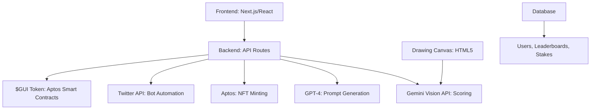

# Promraw: Make NFTs Fun Again 🎨

**Promraw** is an AI-powered creative platform that transforms casual doodling into a competitive, rewarding social experience. Users submit daily sketches based on AI-generated prompts, compete on leaderboards, and earn rewards through the **$GUI token** ecosystem on the **Aptos blockchain**. Built for the **GUI INU Ideathon**, Promraw combines creativity, gamification, and decentralized finance to make NFTs exciting and accessible.

---

## 🌟 What is Promraw?

Promraw tackles the challenges of creativity fatigue, unfair art evaluation, and complex NFT minting by offering:
- **AI-Generated Prompts**: Thousands of quirky, inspiring daily challenges powered by GPT-4 and Gemini AI.
- **Objective AI Scoring**: Gemini Vision API evaluates drawings for creativity, prompt adherence, and quality.
- **Gamified Leaderboards**: Real-time rankings for daily, weekly, and monthly competitions.
- **NFT Minting**: Seamless integration with **Aptos** for one-click, low-cost NFT creation.
- **$GUI Token Economy**: Stake, bet, and earn rewards with our native token.
- **Social Engagement**: Twitter bot automates prompt posting, scoring, and creator amplification.
- **Corporate Tools**: B2B features for brands to run creative campaigns.

---

## 🎯 Why Promraw?

### Problems in the NFT & Digital Art Space
- **Creativity Fatigue**: Artists struggle to stay inspired.
- **Unfair Judging**: Subjective evaluations favor popularity over merit.
- **Complex Minting**: High gas fees and technical barriers deter participation.
- **Low Engagement**: Isolated creation lacks community and fun.

### Our Solutions
- **Endless Inspiration**: AI prompts keep creativity flowing.
- **Fair Scoring**: AI-driven, bias-free evaluation.
- **Simple Minting**: **Aptos** enables fast, low-cost NFT creation.
- **Viral Fun**: Twitter integration and gamified rewards build community.

---

## 🔧 How It Works

### User Journey
1. **See the Prompt**: Daily AI-generated challenges posted on the platform and Twitter (#DrawToEarn).
2. **Create**: Draw using our HTML5 canvas with pro tools (brushes, layers, colors).
3. **Stake & Submit**: Bet $GUI tokens based on confidence in your drawing.
4. **Get Scored**: AI evaluates creativity (40%), prompt adherence (40%), and quality (20%).
5. **Compete**: Climb leaderboards and earn rewards from the prize pool.
6. **Mint NFTs**: Turn high-scoring art into NFTs on **Aptos**.
7. **Share**: Twitter bot roasts or praises your work, boosting visibility.

### Technical Stack

---

## 💰 $GUI Token Economy

### Token Utility
| Function          | Requirement    | Benefit                       |
|-------------------|----------------|-------------------------------|
| **Staking**       | 10-1000 $GUI   | 1.5x-5x reward multipliers   |
| **Betting**       | 5-500 $GUI     | Predict leaderboard positions |
| **NFT Minting**   | 2-50 $GUI      | Enhanced metadata, rarity     |
| **Premium Tools** | 100+ $GUI      | Advanced features, support    |
| **Governance**    | 50+ $GUI       | Vote on prompts and policies  |

### Economics
- **Prize Pool**: 5% platform fee; 2% daily token burn.
- **Revenue**: Fees, minting, corporate campaigns.
- **Deflation**: Burns and staking reduce supply over time.

---

## 🎨 User Experience

### Design Principles
- **Simplicity**: Clean, intuitive interfaces.
- **Responsive**: Works seamlessly on all devices.
- **Gamified**: Achievements, progress bars, and feedback.
- **Accessible**: WCAG 2.1 compliant.

### Key Flows
- **Onboarding**: Connect wallet, tutorial, practice prompt.
- **Daily Competition**: See prompt, draw, stake, submit, share.

---

## 🛠️ Development Roadmap

- **Phase 1**: Core features, AI integration (✅).
- **Phase 2**: **Aptos** minting, $GUI staking, Twitter bot (🔄).
- **Phase 3**: Governance, mobile app (Q3 2025).
- **Phase 4**: AI tools, marketplace (Q4 2025).
- **Phase 5**: Multi-chain, DAO, AR/VR (2026).

---

## 📊 Analytics & Metrics

- **Users**: Target 10K DAU by Q4 2025.
- **Submissions**: 5K+ daily.
- **Engagement**: 15+ min sessions, 70% return rate.
- **Economy**: TVL, transaction volume, creator earnings.

---

## 🔒 Security & Privacy

- **Smart Contracts**: Multi-sig, audits, bug bounties.
- **Data**: Encrypted, GDPR-compliant.
- **AI**: Bias detection, secure prompts.
- **Privacy**: Pseudonymous profiles, data control.

---

## 🌍 Community & Governance

- **Token Distribution**: 40% rewards, 20% team, 15% investors, 15% treasury, 10% liquidity.
- **Governance**: 1K $GUI to propose, 1 $GUI = 1 vote.
- **Programs**: Creator residencies, tutorials, partnerships.

---

## 🚀 Marketing & Growth

- **Community**: Alpha tests, KOLs, Discord.
- **Launch**: Public beta, Twitter campaigns.
- **Adoption**: Corporate partnerships, mobile app.
- **Channels**: Social media, influencers, events.

---

## 📈 Business Model

- **Revenue**: 5% staking fees, premium minting, B2B campaigns.
- **Projections**: 100K users, $2M revenue (Year 1); 2M users, $45M (Year 3).

---

## 🛡️ Risks & Mitigation

- **AI Bias**: Audits, diverse data.
- **Blockchain**: Security audits, insurance.
- **Scalability**: Cloud infrastructure, auto-scaling.

---

*Promraw is a movement to make creativity accessible, rewarding, and fun. Join us in shaping the future of digital art and NFTs!*

🎨 **Make NFTs Fun Again** 🚀
